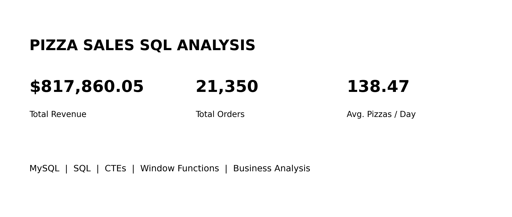
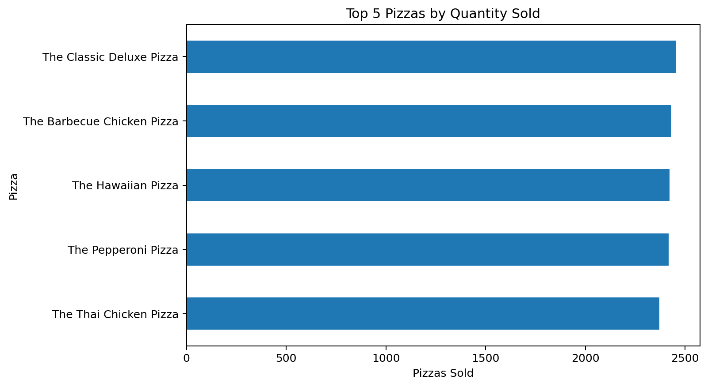
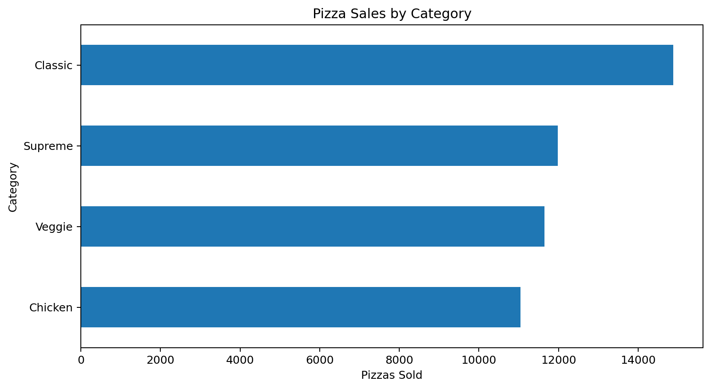
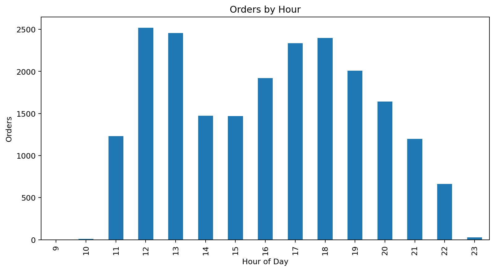

# 🍕 Pizza Sales SQL Analysis

## 📌 Project Overview

This project analyzes pizza sales data using **MySQL** to uncover sales trends, revenue performance, customer ordering patterns, and product performance.

The analysis uses multiple related tables containing order information, pizza details, pizza categories, prices, and quantities.

The goal is to answer important business questions and demonstrate practical SQL skills used in a Data Analyst role.

---


## 🎯 Business Objectives

The analysis focuses on answering questions such as:

* How many orders were placed?
* How much total revenue was generated?
* Which pizzas are the most popular?
* Which pizza sizes are ordered most frequently?
* Which pizza categories generate the most sales?
* What are the busiest ordering hours?
* Which pizzas generate the highest revenue?
* What percentage of revenue does each pizza contribute?
* How does cumulative revenue change over time?
* Which pizzas perform best within each category?

---

## 🗂️ Dataset

The project contains four CSV files:

| Table           | Description                                      |
| --------------- | ------------------------------------------------ |
| `orders`        | Contains order date and time information         |
| `order_details` | Contains pizza orders and quantities             |
| `pizzas`        | Contains pizza size and price information        |
| `pizza_types`   | Contains pizza names, categories and ingredients |

### Database Relationships

```text
orders
   │
   │ order_id
   ▼
order_details
   │
   │ pizza_id
   ▼
pizzas
   │
   │ pizza_type_id
   ▼
pizza_types
```

---

## 🛠️ Tools & Technologies

* **MySQL**
* SQL
* MySQL Workbench
* GitHub
* CSV

### SQL Concepts Used

* SELECT
* WHERE
* GROUP BY
* ORDER BY
* JOIN
* Aggregate Functions
* CASE Statements
* Common Table Expressions (CTEs)
* Subqueries
* Window Functions
* DENSE_RANK()
* SUM() OVER()
* Date & Time Functions
* Percentage Calculations

---

# 📊 Analysis

## 1. Basic Analysis

The following questions were answered:

1. Total number of orders placed
2. Total revenue generated
3. Highest-priced pizza
4. Most common pizza size ordered
5. Top 5 most ordered pizza types

---

## 2. Intermediate Analysis

The analysis also covers:

1. Total quantity of pizzas ordered by category
2. Distribution of orders by hour
3. Percentage distribution of pizzas by category
4. Average number of pizzas ordered per day
5. Top 3 pizza types based on revenue

---

## 3. Advanced Analysis

Advanced SQL techniques were used to calculate:

1. Percentage contribution of each pizza type to total revenue
2. Cumulative revenue over time
3. Top 3 revenue-generating pizzas within each category

---

# 💡 Key Insights

# 💡 Key Findings

The SQL analysis generated the following business insights from the pizza sales dataset.



## 💰 Overall Performance

| KPI                         |          Result |
| --------------------------- | --------------: |
| Total Orders                |      **21,350** |
| Total Revenue               | **$817,860.05** |
| Average Pizzas Sold per Day |      **138.47** |

## 🍕 Product Performance

* **The Classic Deluxe Pizza** was the most ordered pizza, with **2,453 pizzas sold**.
* **The Thai Chicken Pizza** generated the highest revenue at **$43,434.25**.
* The **Large (L)** size was the most frequently ordered size, with **18,956 pizzas sold**.
* **The Greek Pizza** had the highest individual pizza price at **$35.95** for the XXL size.



## 📊 Category Performance

| Category | Pizzas Sold |      Share |
| -------- | ----------: | ---------: |
| Classic  |      14,888 | **30.03%** |
| Supreme  |      11,987 | **24.18%** |
| Veggie   |      11,649 | **23.50%** |
| Chicken  |      11,050 | **22.29%** |

**Key takeaway:** Classic pizzas generated the highest sales volume, representing approximately **30% of all pizzas sold**.



## ⏰ Ordering Patterns

The busiest ordering hours were:

1. **12 PM — 2,520 orders**
2. **1 PM — 2,455 orders**
3. **6 PM — 2,399 orders**
4. **5 PM — 2,336 orders**
5. **7 PM — 2,009 orders**

**Key takeaway:** Customer demand is particularly strong during **lunch hours and early evening**, which could help inform staffing and inventory planning.

## 🏆 Top Revenue-Generating Pizzas

| Rank | Pizza                        |        Revenue |
| ---: | ---------------------------- | -------------: |
|    1 | The Thai Chicken Pizza       | **$43,434.25** |
|    2 | The Barbecue Chicken Pizza   | **$42,768.00** |
|    3 | The California Chicken Pizza | **$41,409.50** |

## 📈 Revenue Contribution

**The Thai Chicken Pizza** was the largest individual contributor to revenue, accounting for approximately **5.31% of total revenue**.

The next highest contributors were:

* The Barbecue Chicken Pizza — **5.23%**
* The California Chicken Pizza — **5.06%**
* The Classic Deluxe Pizza — **4.67%**
* The Spicy Italian Pizza — **4.26%**

## 💡 Business Recommendations

Based on the analysis:

* Promote high-revenue pizzas such as **Thai Chicken** and **Barbecue Chicken**.
* Ensure sufficient inventory and staffing during **12 PM–1 PM** and **5 PM–7 PM**.
* Continue focusing on the **Classic category**, which has the highest sales volume.
* Consider promotional campaigns around high-performing products.
* Use revenue contribution and category performance to support future pricing and marketing decisions.


---

# 📁 Project Structure

```text
Pizza-Sales-SQL-Analysis/
│
├── README.md
│
├── data/
│   ├── orders.csv
│   ├── order_details.csv
│   ├── pizza_types.csv
│   └── pizzas.csv
│
└── sql/
    └── pizza_sales_analysis.sql
```

---

# 🚀 How to Use This Project

### 1. Clone the repository

```bash
git clone https://github.com/YOUR_USERNAME/Pizza-Sales-SQL-Analysis.git
```

### 2. Open MySQL Workbench

Create or connect to your MySQL database.

### 3. Open the SQL file

Open:

```text
sql/pizza_sales_analysis.sql
```

### 4. Import the CSV files

Load the four datasets from the `data` folder into the corresponding MySQL tables.

### 5. Run the analysis queries

Execute the queries in the SQL file to reproduce the analysis.

---

# 📈 Skills Demonstrated

This project demonstrates my ability to:

* Work with relational datasets
* Write SQL queries for business analysis
* Combine multiple tables using JOINs
* Calculate business KPIs
* Analyze sales and revenue trends
* Use CTEs for complex analysis
* Apply SQL window functions
* Rank products within categories
* Translate business questions into SQL solutions

---

## 👨‍💻 About Me

I'm an aspiring **Data Analyst** with hands-on experience in SQL, Power BI, Excel and Python.

I'm continuously building practical projects to strengthen my analytical and problem-solving skills.

### 🔗 Connect With Me

* LinkedIn: https://www.linkedin.com/in/danish-mahmood-bansberia/
* GitHub: https://github.com/danishmahmood34

---

⭐ If you found this project useful, feel free to explore the repository and check out my other data analytics projects.
